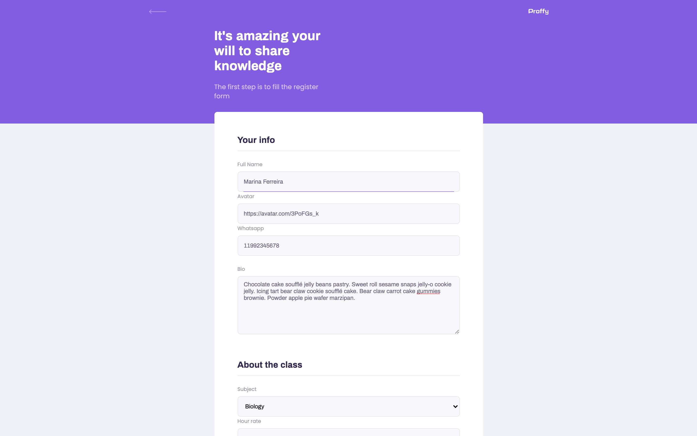

<h1 align="center">
    
     Next Level Week #2 
    NodeJS | ReactJS | React Native
</h1>

  

  

  

   

  

  

  <a href="#bookmark-about">About</a>&nbsp;&nbsp;&nbsp;|&nbsp;&nbsp;&nbsp;
  <a href="#rocket-dependencies">Dependencies</a>&nbsp;&nbsp;&nbsp;|&nbsp;&nbsp;&nbsp;
  <a href="#link-links">Links</a>

 

  
  
  

 

## :bookmark: About

ReactJS web application developed during Education Week. **Proffy** simplifies the connection between
teachers and students by allowing classes to be filtered based on subject and
availability.

## :floppy_disk: Dependencies

-  [NodeJS](https://nodejs.org/en/) - v12.17.0
-  [ReactJS](https://reactjs.org/) - v16.11.0
-  [React DOM](https://reactjs.org/) - v5.2.0

## :link: Links

- [Proffy - React Native](https://github.com/marina-ferreira/proffy-mobile)
- [Proffy - Express API](https://github.com/marina-ferreira/proffy-api)
